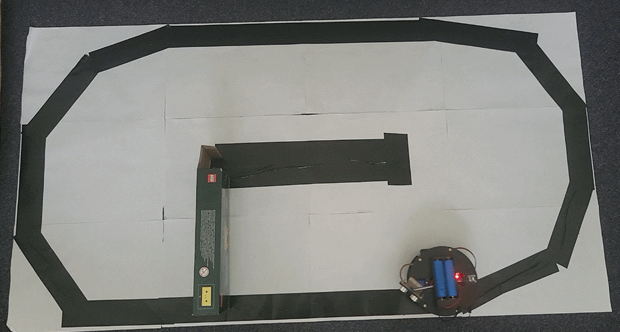

# ESP32 Turtle Robot (KUONGSHUN Turtle Robot AD177 kit)

This project is a small autonomous robotic platform based on an ESP32, two N20 geared motors, an L298N motor driver, an ultrasonic distance sensor mounted on a servo, and optional manual control interfaces.

The robot supports both autonomous navigation and manual control through Wi-Fi or an IR remote.

## Demo



## Features

* Autonomous navigation using a simple behavior-based controller

  * Obstacle detection with an ultrasonic sensor
  * Environment scanning using a servo-mounted sensor
  * Automatic turning and avoidance behavior
* Manual control via Xbox controller over Wi-Fi UDP
* Manual control via IR remote (NOT CORRECTLY IMPLEMENTED)
* Automatic fallback to autonomous mode when no manual commands are received
* Modular firmware structure using PlatformIO

## Usage

### Firmware

Build and upload the firmware using PlatformIO:

```bash
cd firmware
pio run --target upload
```

### Xbox Controller

1. Power the robot.
2. Connect your PC to the robot's Wi-Fi network.
3. Activate the Python virtual environment:

```bash
cd controller
source venv/bin/activate
```

4. Start the controller:

```bash
python xbox_controller.py
```

### Autonomous Mode

When no manual commands are received for a short period, the robot automatically switches to autonomous navigation mode.

## Configuration

Network settings, robot behavior parameters, motor speeds, and sensor thresholds can be adjusted in the firmware source code.

The robot IP address and additional configuration details can be added here as the project evolves.

## Project Structure
```text
.
├── controller
│   ├── venv
│   └── xbox_controller.py
├── firmware
│   ├── include
│   │   ├── behaviors
│   │   │   ├── avoid_line.h
│   │   │   └── avoid_object.h
│   │   ├── brain
│   │   │   └── robot_brain.h
│   │   ├── drivers
│   │   │   ├── ir_remote_control.h
│   │   │   ├── line_sensor.h
│   │   │   ├── motors.h
│   │   │   ├── ultrasonic_sensor.h
│   │   │   ├── ultrasonic_servo.h
│   │   │   └── wifi_control.h
│   │   └── README
│   ├── lib
│   │   └── README
│   ├── platformio.ini
│   ├── src
│   │   ├── behaviors
│   │   │   ├── avoid_line.cpp
│   │   │   └── avoid_object.cpp
│   │   ├── brain
│   │   │   └── robot_brain.cpp
│   │   ├── drivers
│   │   │   ├── ir_remote_control.cpp
│   │   │   ├── line_sensor.cpp
│   │   │   ├── motors.cpp
│   │   │   ├── ultrasonic_sensor.cpp
│   │   │   ├── ultrasonic_servo.cpp
│   │   │   └── wifi_control.cpp
│   │   └── main.cpp
│   └── test
│       └── README
└── README.me
```
